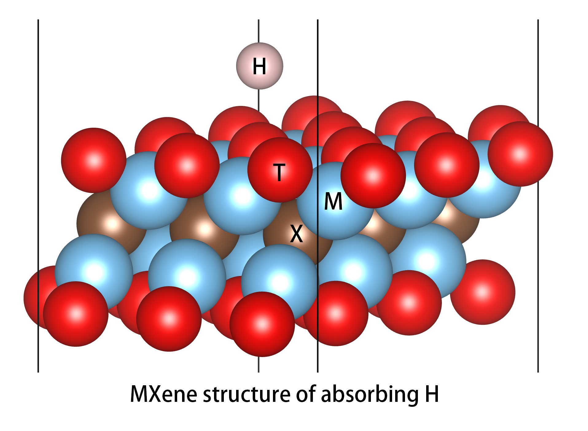
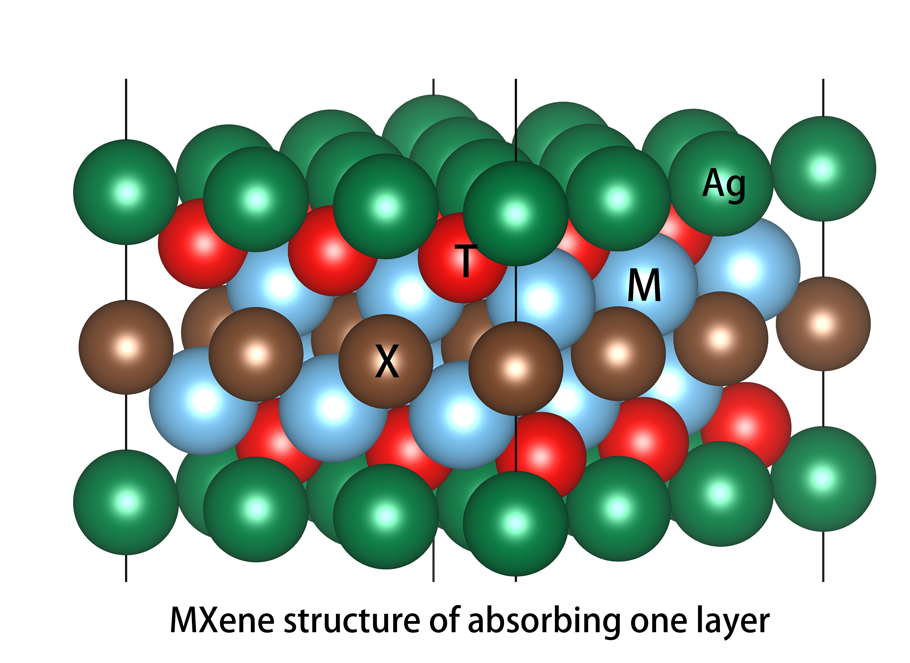

Absorb
=======

In the fields of catalysis and battery materials, various adsorbents are often designed, and various adsorption models
need to be built. ``mxene`` provides this tool:

There are three common adsorption sites: top, bridge and hollow. You can use the tools in ``mxene`` to define the location
and type of adsorption atoms.

    >>> from mxene.core.mxenes import MXene
    >>> from pymatgen.io.vasp import Poscar
    >>> pos = MXene.from_file('POSCAR')
    >>> pos.add_absorb(site_type= "top", absorb= "H")

``mxene`` also provides a tool for batch generation of randomly adsorbed atomic crystal structures on
material surfaces, which may be conveniently used in the calculation of isoenergetic surface.

    >>> from mxene.core.mxenes import MXene
    >>> from pymatgen.io.vasp import Poscar
    >>> pos = MXene.from_file('POSCAR')
    >>> structures = pos.add_face_random(number=10, random_xy=True, add_atom="H", up_down="up", offset_z=1.0)
    >>> print(structures[0])
    >>> structures[0].show()

At the same time, ``mxene`` also supports layered adsorption.

which is often used in the calculation of battery materials.

    >>> from mxene.core.mxenes import MXene
    >>> from pymatgen.io.vasp import Poscar
    >>> pos = MXene.from_file('POSCAR')
    >>> pos.add_next_layer_atoms(site_type="fcc",site_atom="Ag",up_down="up_and_down")