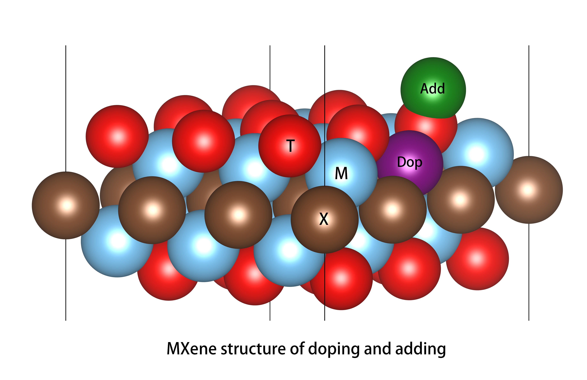

Dop and Add
============

Dop or add can effectively change the electronic structure of MXenes based materials, which is an effective strategy
to control the properties of materials themselves. ``mxene`` provides this way to create crystal structures:

**Method 1:**

    >>> from pymatgen.io.vasp import Poscar
    >>> structures = MXene.from_standard(terminal_site='fcc', terminal="O", base="Ti", doping="Mo", add_atoms='Fe', add_atoms_site=(0.24, 0.82, 0.64), coords_are_cartesian=False)

**Method 2:**

In addition to the above method, you can also read the existing POSCAR and convert it into ``Structure`` through pymatgen,
and then successively dop or add to form a new POSCAR:

    >>> from pymatgen.io.vasp import Poscar
    >>> pos = Poscar.from_file('POSCAR')
    >>> st = pos.structure
    >>> st.replace(44, "Mo")

    >>> st.append("Fe", [0.24, 0.82, 0.64])
    >>> st.insert(45, "Fe", [0.24, 0.82, 0.64])

