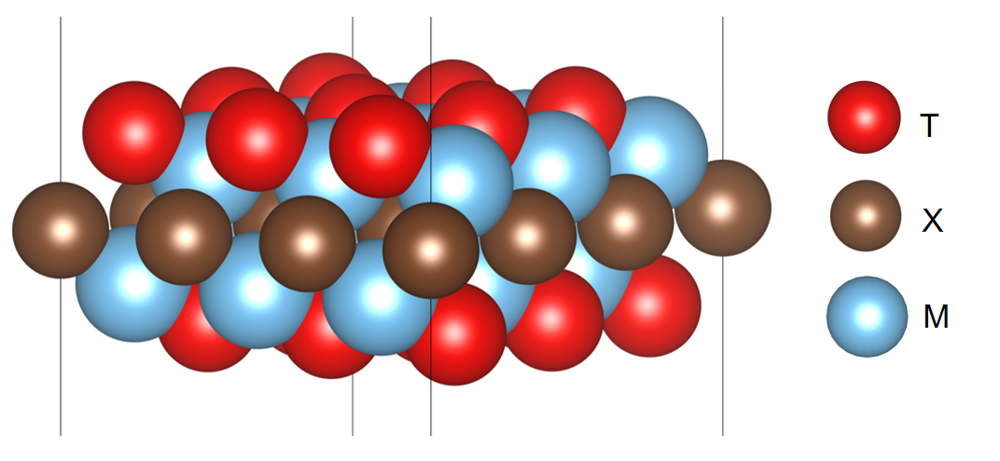

Background of MXene
===================

MXene
::::::::::::

MXenes is the general name of two-dimensional transition metal carbides, nitrides or carbonitrides. It is a new type of
graphene like two-dimensional structural material jointly discovered by Professor Yury Gogotsi of Drexel University and
Professor Michel W. Barsoum in 2011. The general chemical formula can be expressed as Mn+1XnTx, where M refers to transition
metals (such as Ti, Zr, Hf, V, Nb, Ta, Cr, Sc, etc.), X refers to C or N, n generally 1-3, and Tx refers to surface groups
(such as O2-, OH-, F-, etc.). It is mainly obtained by extracting weakly bound A-site elements (such as Al atoms) from
the MAX phase through the mixed solution of HF acid or hydrochloric acid and fluoride. Due to the diversity of the
composition and structure of the MAX phase, MXene materials derived from it have also become the largest family of
two-dimensional materials, with more than 100 theoretically predicted and more than 40 currently synthesized.

Application
::::::::::::

MXene's unique two-dimensional layered structure, high density, metalloid conductivity, adjustable surface terminal groups,
excellent mechanical properties and pseudo capacitor energy storage mechanism make it a very promising electrochemical
energy storage material. It has unique application advantages in many advanced energy storage devices, such as supercapacitors,
lithium/sodium/potassium ion batteries, lithium sulfur batteries, water-based zinc ion batteries, etc. Therefore, MXene
has become a frontier hotspot in the field of energy materials.

